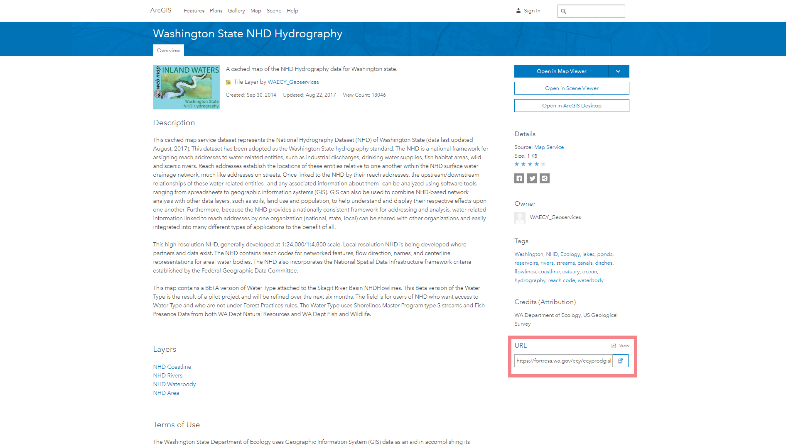
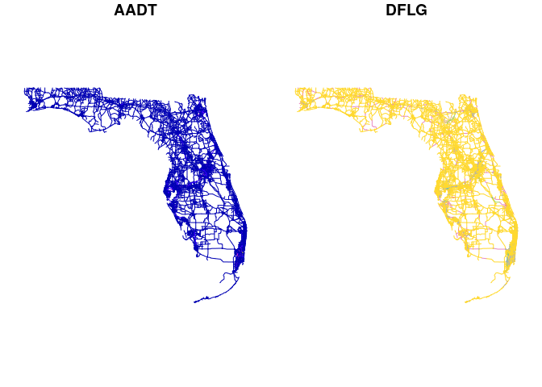
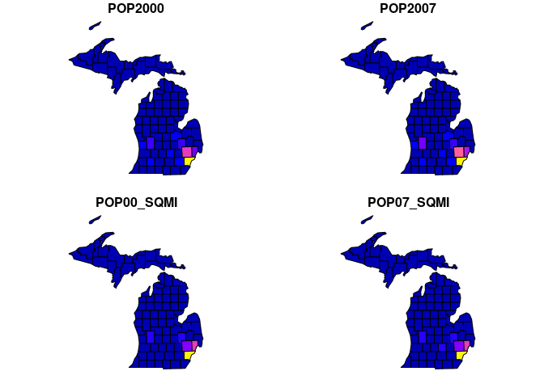

# esri2sf

Scraping Geographic Features from ArcGIS Server

Still many geographic data is delivered through ESRI’s ArcGIS Server. It
is not easy to utilize the geographic data in the GIS servers from data
analysis platform like R or Pandas. This package enables users to scrape
vector data in ArcGIS Server from R through the server’s REST API. It
download geographic features from ArcGIS Server and saves it as [Simple
Features](https://cran.r-project.org/web/packages/sf/vignettes/sf1.html).

## How it works

This program sends a request to an ArcGIS Server and gets json responses
containing coordinates of geometries of which format is not the same as
geojson. So it converts the json into simple feature geometries from the
response. Then it combines attribute data to the geometries to create sf
dataframe. Often ArcGIS servers limits the maximum number of rows in the
result set. So this program creates 500 features per request and
automatically re-send requests until it gets all features in the
dataset.

## Install

Use
[remotes](https://cran.r-project.org/web/packages/remotes/index.html) to
install this package. This package has dependency on dplyr, sf, httr,
jsonlite, rstudioapi, DBI, RSQLite, crayon.

    library(remotes)
    install_github("yonghah/esri2sf")

## How to use

What you need is the URL of REST service you want. You can get the URL
by viewing the URL widget on the service’s webpage (see image below), by
asking a GIS admin, or looking at the javascript code of a webpage where
it creates a feature layer.

### Point data

    library("esri2sf")
    url <- "https://services.arcgis.com/V6ZHFr6zdgNZuVG0/arcgis/rest/services/Landscape_Trees/FeatureServer/0"
    df <- esri2sf(url)

    ## Layer Type: Feature Layer

    ## Geometry Type: esriGeometryPoint

    ## Service Coordinate Reference System: 3857

    ## Output Coordinate Reference System: 4326

    plot(df)

    ## Warning: plotting the first 9 out of 56 attributes; use max.plot = 56 to plot
    ## all

<!--  -->

### Polyline data

You can filter output fields. This may take a minute since it gets 18000
polylines.

    url <- "https://services.arcgis.com/V6ZHFr6zdgNZuVG0/arcgis/rest/services/Florida_Annual_Average_Daily_Traffic/FeatureServer/0"
    df <- esri2sf(url, outFields=c("AADT", "DFLG"))

    ## Layer Type: Feature Layer

    ## Geometry Type: esriGeometryPolyline

    ## Service Coordinate Reference System: 3857

    ## Output Coordinate Reference System: 4326

    plot(df)

<!--  -->

### Polygon data

You can filter rows as well by giving a `where` condition.

    url <- "https://sampleserver1.arcgisonline.com/ArcGIS/rest/services/Demographics/ESRI_Census_USA/MapServer/3"
    df <- esri2sf(url, 
                  where = "STATE_NAME = 'Michigan'", 
                  outFields = c("POP2000", "pop2007", "POP00_SQMI", "POP07_SQMI"))

    ## Layer Type: Feature Layer

    ## Geometry Type: esriGeometryPolygon

    ## Service Coordinate Reference System: 4269

    ## Output Coordinate Reference System: 4326

    plot(df)

<!--  -->

### Tabular data

You can download non-spatial tables of the ‘Table’ layer type using
`esri2df()`.

    df <- esri2df('https://sampleserver1.arcgisonline.com/ArcGIS/rest/services/WaterTemplate/WaterDistributionInventoryReport/MapServer/5', objectIds = paste(1:50, collapse = ","))

    ## Layer Type: Table

    df

    ## # A tibble: 50 x 6
    ##    OBJECTID FACILITYID FCLASS ASSETCOND CONDDATE REPLSCORE
    ##       <int> <chr>      <chr>  <lgl>     <lgl>        <int>
    ##  1        1 1          wMain  NA        NA               0
    ##  2        2 2          wMain  NA        NA              45
    ##  3        3 3          wMain  NA        NA              45
    ##  4        4 4          wMain  NA        NA              45
    ##  5        5 5          wMain  NA        NA              15
    ##  6        6 6          wMain  NA        NA              15
    ##  7        7 1          wMain  NA        NA               0
    ##  8        8 2          wMain  NA        NA              45
    ##  9        9 3          wMain  NA        NA              45
    ## 10       10 4          wMain  NA        NA              45
    ## # … with 40 more rows
